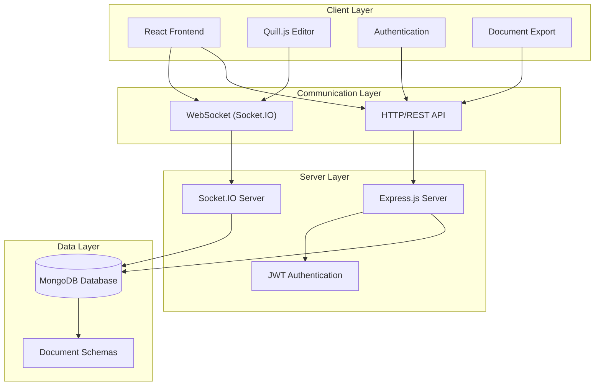
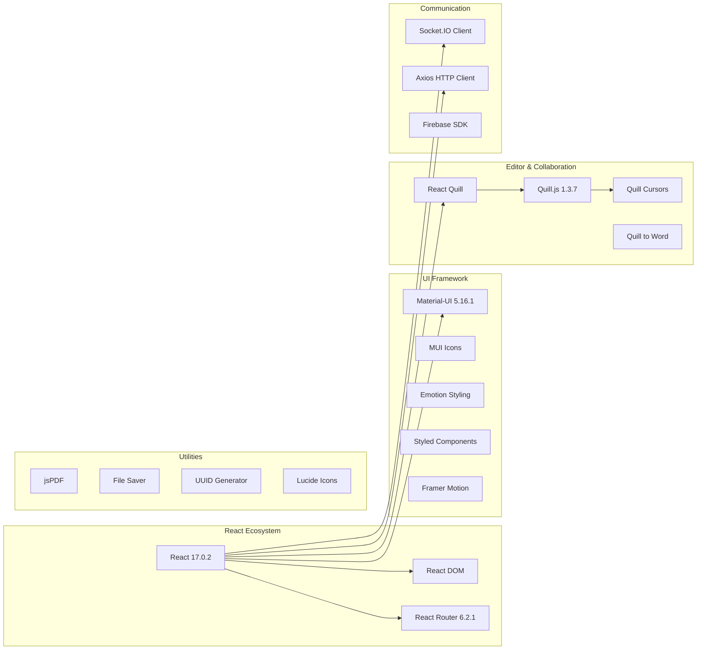
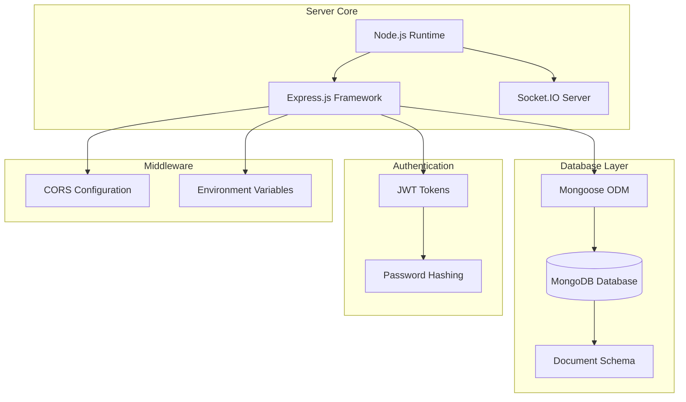
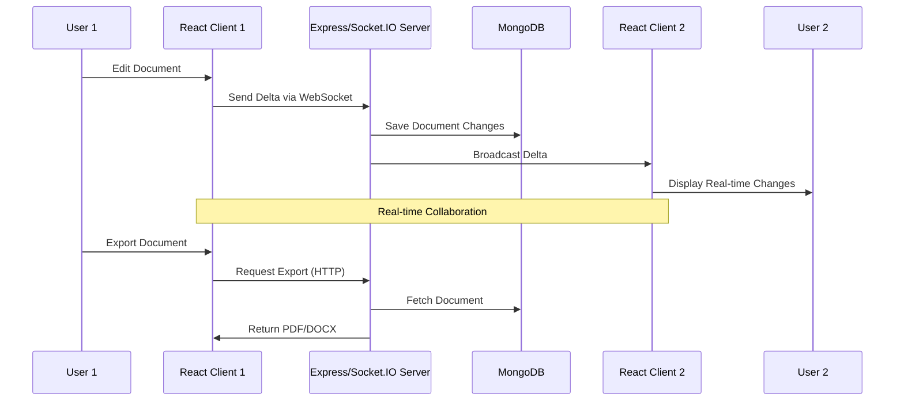
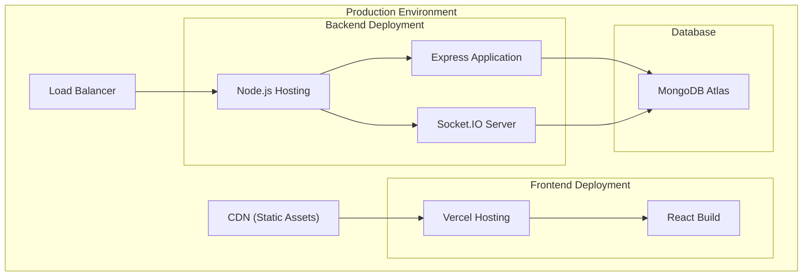
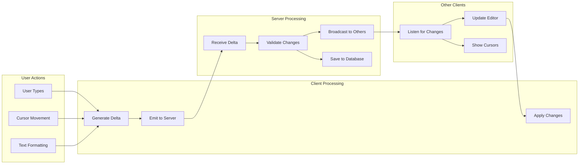

# CoCreate - Real-Time Collaborative Document Editor

<p align="center">
  
  
  
  
</p>

CoCreate is a modern, real-time collaborative document editing platform that enables seamless teamwork with live synchronization, rich text editing, and integrated communication features. [1](#2-0) 

## 🚀 Key Features

- **Real-Time Synergy**: Collaborate with your team in real-time, witnessing changes as they unfold before your eyes [1](#2-0) 
- **Integrated Discourse**: Engage in meaningful discussions directly within your documents with built-in chat [2](#2-1) 
- **Rich Text Editing**: Advanced formatting with Quill.js editor
- **Document Export**: Export to PDF and DOCX formats [3](#2-2) 
- **User Authentication**: Secure registration and login system
- **Live Cursors**: See collaborators' cursors in real-time

## 🏗️ System Architecture



## 🛠️ Technology Stack

### Frontend Architecture



### Backend Architecture



## 📊 Data Flow Diagram



## 🔧 Technology Stack Details

### Frontend Dependencies [4](#2-3) 

| Category | Technology | Version | Purpose |
|----------|------------|---------|---------|
| **Core Framework** | React | 17.0.2 | UI Framework |
| **UI Library** | Material-UI | 5.16.1 | Component Library |
| **Text Editor** | Quill.js | 1.3.7 | Rich Text Editing |
| **Real-time** | Socket.IO Client | 4.4.1 | WebSocket Communication |
| **Styling** | Styled Components | 6.1.11 | CSS-in-JS |
| **HTTP Client** | Axios | 1.6.7 | API Requests |
| **Export** | jsPDF | 2.5.1 | PDF Generation |
| **Authentication** | Firebase | 10.12.3 | User Management |

### Backend Dependencies

| Category | Technology | Purpose |
|----------|------------|---------|
| **Server** | Express.js | HTTP Server Framework |
| **Real-time** | Socket.IO | WebSocket Server |
| **Database** | MongoDB + Mongoose | Data Persistence |
| **Authentication** | JWT + bcryptjs | Secure Authentication |
| **Environment** | dotenv | Configuration Management |

## 📁 Project Structure

```
CoCreate/
├── client/                          # React Frontend
│   ├── public/                      # Static Assets
│   ├── src/
│   │   ├── components/              # Reusable Components
│   │   ├── pages/                   # Application Pages
│   │   │   ├── Home.jsx            # Landing Page
│   │   │   ├── Register.jsx        # User Registration
│   │   │   └── Login.jsx           # User Login
│   │   ├── utils/                   # Utility Functions
│   │   └── App.js                  # Main App Component
│   ├── package.json                # Frontend Dependencies
│   └── README.md                   # Client Documentation
├── server/                          # Node.js Backend
│   ├── controller/                  # Business Logic
│   ├── routes/                      # API Routes
│   ├── schema/                      # Database Schemas
│   ├── database/                    # Database Configuration
│   ├── index.js                    # Server Entry Point
│   └── package.json                # Backend Dependencies
└── README.md                       # Project Documentation
```

## 🚀 Quick Start

### Prerequisites
- Node.js (v14+)
- MongoDB
- npm/yarn

### Installation & Setup

1. **Clone Repository**
   ```bash
   git clone https://github.com/im-vishesh15th/CoCreate.git
   cd CoCreate
   ```

2. **Backend Setup**
   ```bash
   cd server
   npm install
   
   # Create .env file
   echo "MONGODB_URI=your_mongodb_connection_string
   JWT_SECRET=your_jwt_secret
   PORT=5000" > .env
   
   npm start
   ```

3. **Frontend Setup** [5](#2-4) 
   ```bash
   cd ../client
   npm install
   npm start
   ```

### Available Scripts

#### Frontend [5](#2-4) 
- `npm start` - Development server
- `npm run build` - Production build
- `npm test` - Run tests
- `npm run eject` - Eject from CRA

#### Backend
- `npm start` - Start server
- `npm run dev` - Development with nodemon

## 🌐 Deployment Architecture



### Deployment URLs [6](#2-5) 
- Production: `https://co-create-create-2.vercel.app`
- Staging: `https://co-create-ui-vishesh-guptas-projects.vercel.app`

## 🔄 Real-Time Collaboration Flow



## 🤝 Contributing

1. Fork the repository
2. Create feature branch (`git checkout -b feature/amazing-feature`)
3. Commit changes (`git commit -m 'Add amazing feature'`)
4. Push to branch (`git push origin feature/amazing-feature`)
5. Open Pull Request

## 📄 License

This project is licensed under the MIT License.

---

**CoCreate** - Crafting the future of collaboration. ✨


